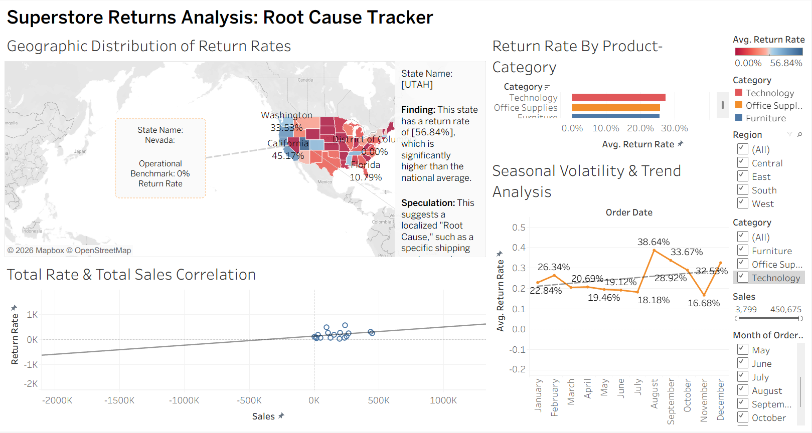

# 📦 Superstore Returns Analysis
**Presentation Link:** [Watch the Video Here](https://drive.google.com/file/d/1gXx_rbWpJ59tJy7QHkw29tiJ1RY7I30U/view?usp=drive_link)

## 🔗 Project Link
**Tableau Public Workbook:** [View Interactive Dashboard](https://public.tableau.com/app/profile/lentz.francois/viz/1FinishedStoryTellingWithDataProject/FinalStoryMapping?publish=yes)

---

## 📋 Project Objective
This analysis was prepared for the **Superstore CEO** to identify the root causes of high return rates. The goal is to move beyond simple sales volume and understand the geographic, seasonal, and product-specific factors driving profit loss.

## 🔍 Key Insights & Findings
* **The Geography Problem:** The **Western Region** remains a massive outlier in return volume. The regional trend suggests logistical or shipping hurdles that require a deep-dive audit of distribution centers in that territory.
* **High-Risk Categories:** * **Technology:** 27.3% (Highest)
    * **Office Supplies:** 25.7%
    * **Furniture:** 25.6%
* **The Root Cause:** While percentages are within a narrow 1.7% range, the **financial impact** is greatest in Technology. Due to the high unit cost of electronics, a 27.3% return rate represents a significantly higher capital loss than returns in other categories.
* **Statistical Context:** With a **P-value of 0.20**, there is a weak correlation between total sales and total returns. This confirms that high returns are not simply a byproduct of high sales volume, but are linked to specific quality and logistical issues.

## 🖥️ Dashboard Functionality
The final dashboard is a fully synchronized executive monitoring tool including:
1. **Geographic Map:** Visualizes return "hotspots" to identify regional failures.
2. **Product Category Analysis:** Compares return rates across the three main business segments.
3. **Sales vs. Returns Scatterplot:** Monitors the relationship between volume and return frequency.
4. **Customer Tracker:** Features a **Descending Sort** to immediately flag "serial returners."

> **Interactivity:** This dashboard features **four global filters** (Region, Category, and more). These are applied to **all worksheets** in the data source; toggling any filter will instantly update every chart on the dashboard to ensure data consistency.

## 🚀 Proposed Next Steps
* **Technology Quality Audit:** Investigate top-returned Tech items to determine if defects or poor protective packaging are to blame.
* **Western Region Logistics Review:** Audit shipping partners in the West to address the high return volume.
* **Policy Refinement:** Use the sorted Customer Tracker to identify if a small group of customers requires a more stringent return policy.

---

## 📁 Submission Contents
| File Name | Description |
| :--- | :--- |
| `README.md` | Project summary and Tableau Public Link. |
| `Sketches.pdf` | 3 Low-fidelity pen-and-paper dashboard mock-ups. |
| `Dashboard_Final.png` | Screenshot of the final dashboard with title and filters. |
| `Story_Draft.png` | Screenshot of the 7-point story arc captions. |

---
*Note: The presentation exceeds the 5-minute suggestion to provide a thorough demonstration of the four synchronized filters and the root cause analysis requested by the rubric.*
