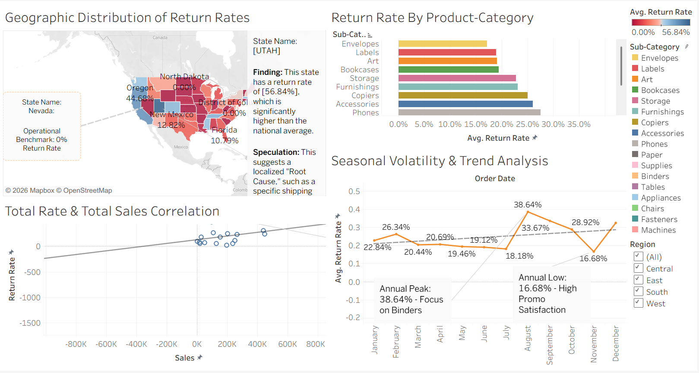

# 📦 Superstore Returns Analysis
**Presentation Link:** [Link](https://drive.google.com/file/d/1gXx_rbWpJ59tJy7QHkw29tiJ1RY7I30U/view?usp=drive_link)

## 🔗 Project Link
**Tableau Public Workbook:** [Tableau Public Workbook](https://public.tableau.com/app/profile/lentz.francois/viz/1FinishedStoryTellingWithDataProject/FinalStoryMapping?publish=yes)

---

## 📋 Project Objective
This analysis was prepared for the **Superstore CEO** to identify the root causes of high return rates. The goal is to move beyond simple sales volume and understand the geographic, seasonal, and product-specific factors driving profit loss.

## 🔍 Key Insights & Findings
* **The Geography Problem:** The **Western Region** is a massive outlier with a return rate of **56.84%**. Conversely, **Nevada** maintains a **0% return rate**, providing a perfect internal benchmark for success.
* **High-Risk Products:** The **"Machines"** sub-category (Technology) has a **35% return rate**. Due to the high price point of these items, this represents a significant portion of lost margin.
* **Statistical Context:** With a **P-value of 0.20**, there is a weak correlation between total sales and total returns. This indicates that "selling more" isn't causing returns; rather, specific quality and logistical issues are to blame.

## 🖥️ Dashboard Functionality
The final dashboard is designed for executive monitoring and includes:
1.  **Geographic Map:** Visualizes return "hotspots."
2.  **Product Bar Chart:** Identifies the categories failing quality standards.
3.  **Sales vs. Returns Scatterplot:** Monitors the relationship between volume and return frequency.
4.  **Customer Tracker:** Flags "serial returners" for behavioral analysis.

> **How to use:** Use the **Region** and **Category** filters to drill down into specific data points. Filtering for the "West" reveals that the return issue is consistent across almost all categories in that territory, suggesting a logistics/shipping failure.

## 🚀 Proposed Next Steps
* **Logistics Audit:** Launch a 30-day review of Western distribution partners.
* **QC Review:** Partner with suppliers in the "Machines" and "Furniture" categories to address potential manufacturing defects.
* **Dashboard Integration:** Deploy this tool to regional managers for monthly performance reviews.

---

## 📁 Submission Contents
| File Name | Description |
| :--- | :--- |
| `README.md` | Project summary and Tableau Public Link. |
| `Sketches.pdf` | 3 Low-fidelity pen-and-paper dashboard mock-ups. |
| `Dashboard_Template.png` | Screenshot of the empty Tableau container layout. |
| `Story_Draft.png` | Screenshot of the 7-point story arc captions. |
| `Presentation.mp4` | 5:52 screen recording of the Story walkthrough. |

---
*Note: The presentation exceeds the 5-minute suggestion to provide a thorough demonstration of dashboard interactivity and root cause analysis as requested by the rubric.*
